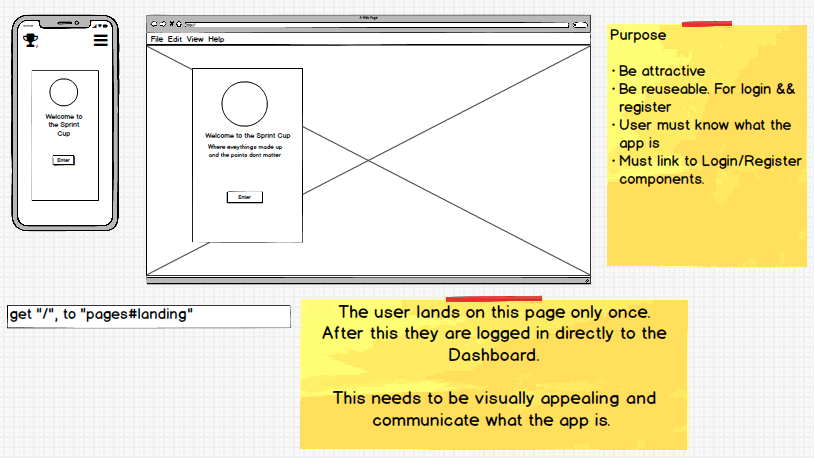
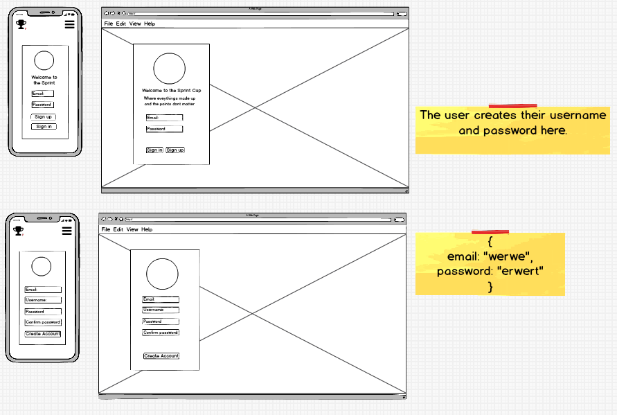
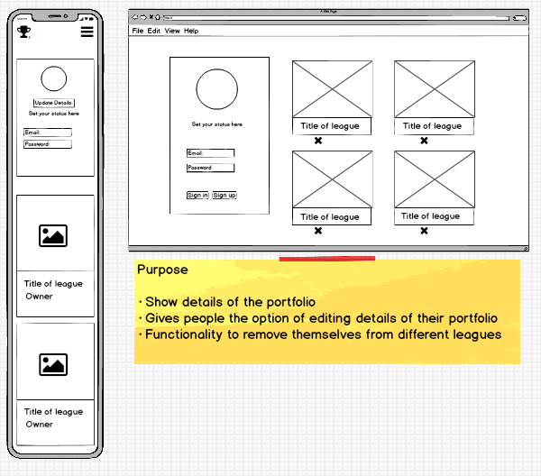
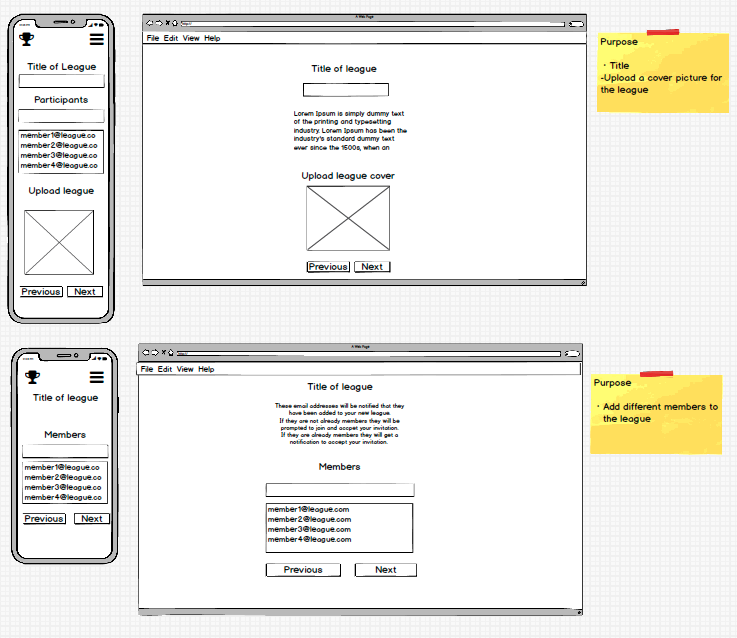
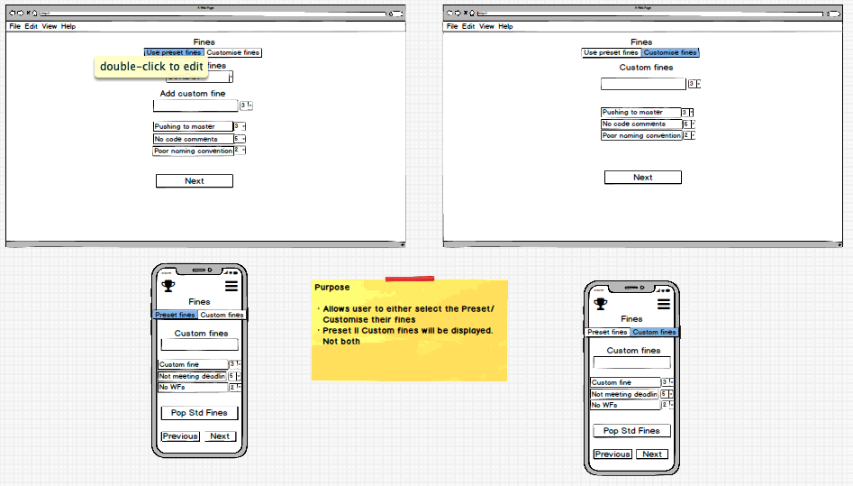
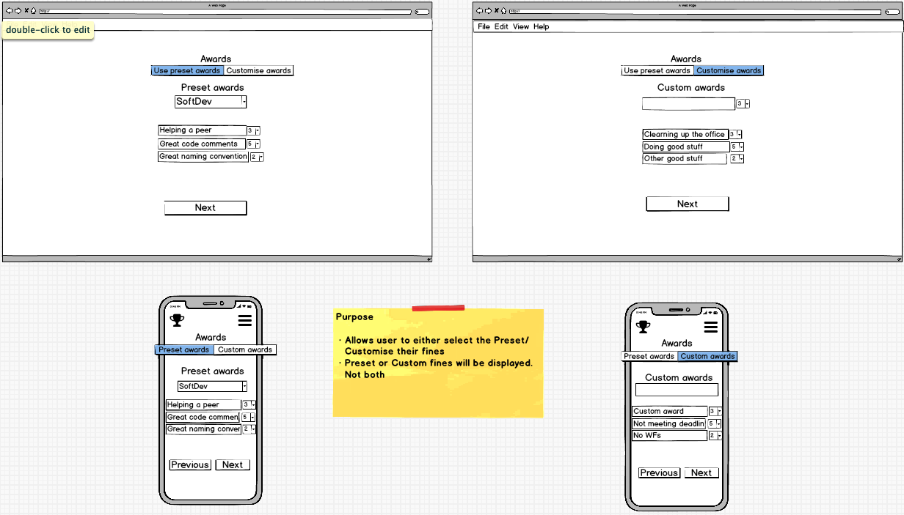
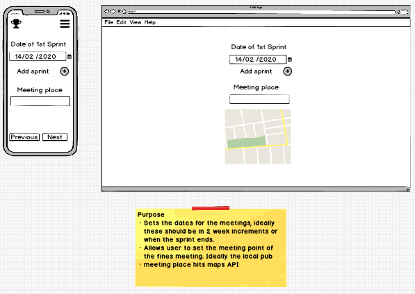
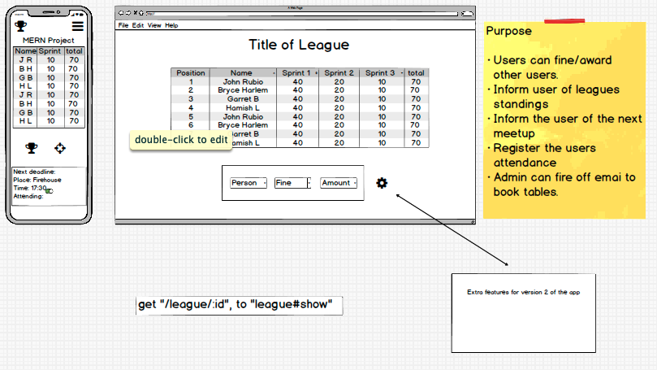
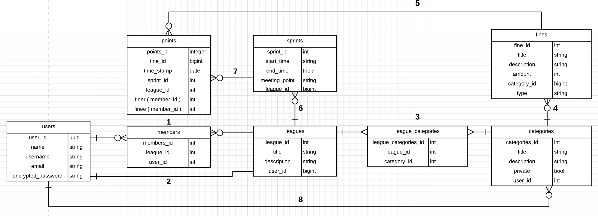

# Sprint Cup

###### Trello board to keep me on track

Link: https://trello.com/b/SlsaxtXS/sprintcup

## Overview

This app aims to solve 2 problems. It will be a tool to encourage good coding culture and promote socialisation within your teams. Users will have the opportunity to create a _League_ and add other users to it. Within that league there will be certain _fines_ and _rewards_ which all members can give to each other.

eg if someone were to do a teach back on a particular topic to the team then they would receive a reward from one of their peers. Or if they were to push code to the repo without writing tests for it then they would receive a fine from their peers.

The fines and rewards will be tracked and at the end-of-sprint meeting ( generally 2 weeks ) there will be a fun social "fines meeting". This is an opportunity to share a drink with your team-mates and discuss what went wrong and what went well that term. The different members will also be held accountable for the points they have accrued, which will relate to the drink of their choice. ie not writing tests for your feature will result in a fine of 3 sips of your beverage.

---

## Local Install Steps

The app makes use of the venv pip package to create a virtual environment. Therefore the package will need to be installed in order to run the app. There after the install instructions are as below:

- Clone the repo: `git clone https://github.com/brucemcclure/demo_app`
- Change directory into the repo: `cd demo_app`
- Make sure venv is installed: `pip install venv`
- Create the virtual environment: `python3 -m venv venv`
- Activate the virtual environment: `source venv/bin/activate`
- Install the dependencies from requirments.txt: `pip3 install -r requirements.txt`
- Run the app: `python src/main.py`

---

## CI/CD

The CI/CD pipeline was created using Github Actions. It uses Python3.8, Pip3 and runs on the latest stable version of Ubuntu. The pipeline is started on a push to master.

Once it has pulled from master it installs the dependencies form requirements.txt and then it runs the tests in the tests directory.

---

## Wireframes

#### Known missing wire frames

1. The modal for notification
2. Associated accounts ie friends. Is this necessary?

#### Landing page

The landing page is where the user will be directed to when they are not logged in. It should be attractive and represent what the app is about. It has the logo and a short welcome message on the card. The large image the card is on top of should be vibrant and colourful.

#### Login and signup

When the user clicks enter, the card's contents changes to the login form. The user enters their credentials and is then directed to the dashboard page. If the user is not already a member of the app then they will sign up. Once again they will be directed to the dashboard page.

#### Dashboard page

This page is specific to each user. Its features are;

- Shows the leagues that the user is a part of
- Search leagues throughout the app i.e. not just the ones the user has been invited to.
- Has a create league button.
- Shows notifications, eg invitations or fines/rewards ( this will be a modal )
- Logout button. This will delete the stored JWT
- Edit profile button. This will link the user to the Edit Profile page.

#### User profile page

This page is where the user can change their username, password and profile picture. It also shows which leagues they are a part of and will link them to that league.

- The user will be able to update and delete their profile

#### Create league page 1

When the user creates a league they will be directed to this page. It is a wizard form consisting of 5 parts. Each time the user clicks _next_ the new section of the form is presented to them, and the data they have already entered remains saved in state so the final _create_ is sent in one request.

The first part of the form is just The title of the league that will be created, a short description of the purpose of the leagues etc and finally the upload button for the cover picture.

The second part of the form is adding members. Once the members are added then emails are sent off to join the app. If they are already members of the app then a notification will be sent to them, when they accept they will be added to the league.

#### Create league page 2

Part three of the form is choosing the _fines_ ie the behaviour the app is trying to correct. This should be light hearted in nature. We aren't trying to solve world hunger here. The user creating the league has the option of choosing a preset list of fines or making a custom list of fines ( Or choose a preset list of fines and adding a few custom fines to it ). There will be conditional rendering based on which button is clicked. This is demonstrated in the two screens shown side by side. Each fine has a numeric value associated with it. eg pushing code without tests will have a `-3` value.

#### Create league page 3

This has the same functionality as the previous part of the form where _fines_ were defined for the league. The only difference is that this part is dedicated to _rewards_ . A user would be rewarded for something like presenting a teach back on a topic that they know something about.

#### Create league page 4

The final part of the wizard form is adding the deadlines for the sprints. These would ideally be two weeks apart but they could be shorter or longer depending on the needs of the league/user. When creating the sprint 2 pieces of data are needed. The first is the date the sprint will be ending and the second is the venue where the members of the league will be meeting after the sprint has ended. Ideally the user creating the league will post 3-5 sprint deadlines in this part of the form but only one is mandatory.

The meeting place queries Google Maps and displays the venue on the map on the desktop version of the app.

#### League view page

The last page of v1.0 of the app is the league view page. This shows a table of the league and where everyone is ranked. It also shows how everyone did in previous sprints. Each row of the table is selectable and when selected it gives the user the opportunity to reward/fine that person. The Leave view page also shows when and where the next end-of-sprint meeting is and the user can register their attendance.

---

## WIP DB Schema

1. A user can be a member of many leagues
2. A league has only 1 owner. ie a league is owned by user.
3. A league has many categories i.e. League has many categories though league_categories.
4. A category has many fines ( A fine can be regarded as a reward/fine ).
5. Each 'point' has a fine associated with it and it an be awarded many times.
6. A League has many sprints. A sprint is only associated with 1 league.
7. A league has many points

---

## Swagger endpoints

This is for you to workout for now. It can be pretty tricky Im not going to lie but I believe in you.
